<div align="center">


# Travels

**Every trip you've ever taken, on one map.**

A self-hosted travel log built around a full-screen interactive map. Each journey
is a real routed track — not a pin — drawn in its own colour, with its stops, its
dates, and the distance you actually covered. A dozen trips or two hundred,
it stays one page: pick a year, search a country, tap a route, and the map flies
to it.

No database, no accounts, no API keys. Trip metadata is a JavaScript file, route
geometry is GeoJSON on disk, and the whole thing deploys as static files.

[](https://react.dev)
[](https://vite.dev)
[](https://leafletjs.com)
[](https://pages.cloudflare.com)
[](#1-prerequisites)
[](LICENSE)

<br />

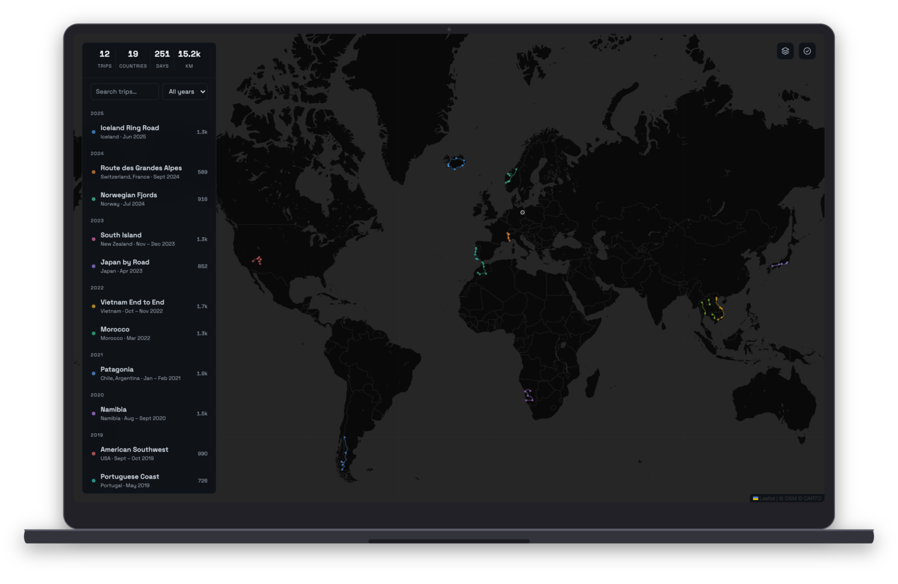

<br /><br />

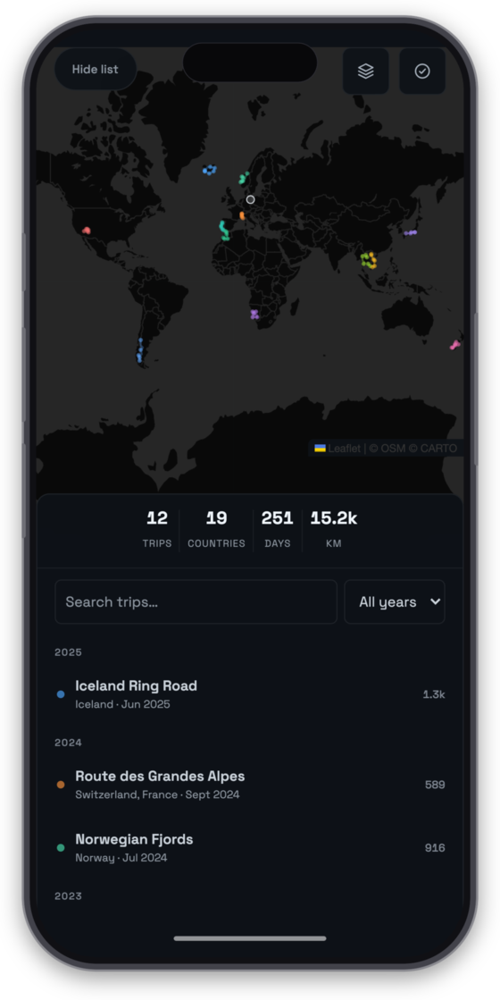&nbsp;&nbsp;
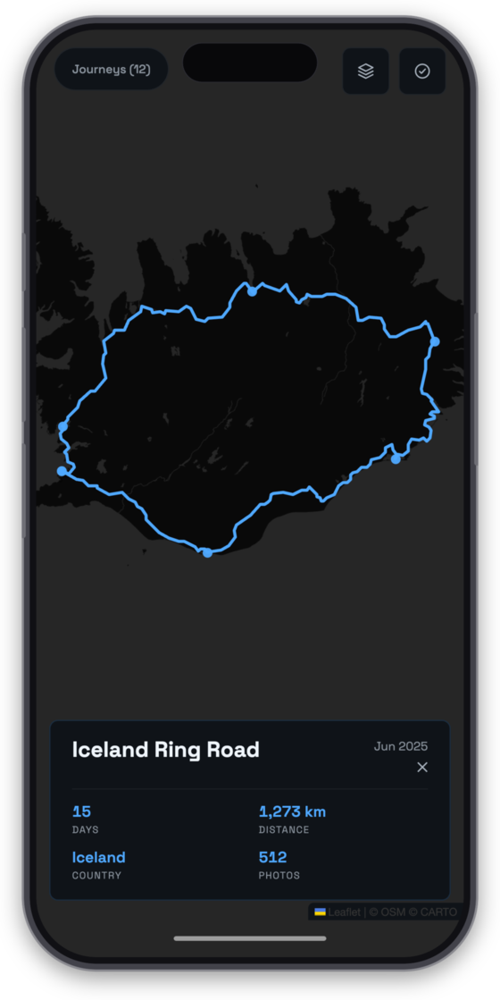&nbsp;&nbsp;
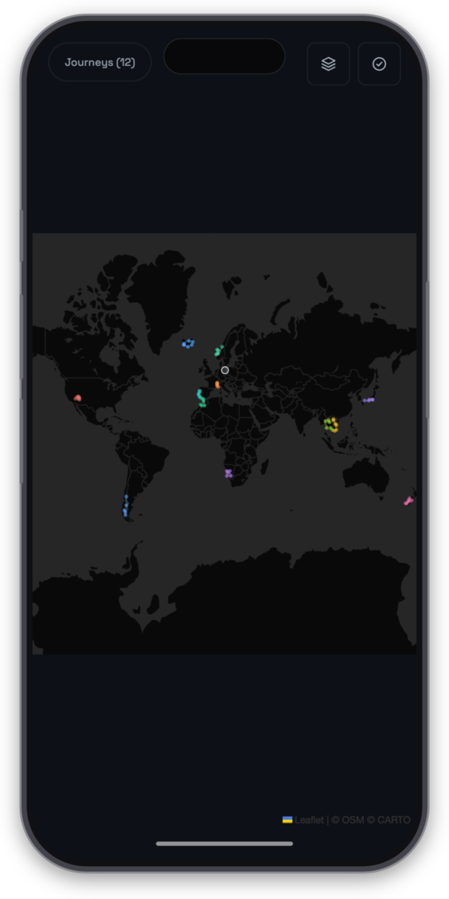

</div>

---

## Contents

- [Feature Tour](#feature-tour)
- [How It's Built](#how-its-built)
- [Self-Hosting Guide](#self-hosting-guide)
  - [1. Prerequisites](#1-prerequisites)
  - [2. Clone and Install](#2-clone-and-install)
  - [3. Add Your First Trip](#3-add-your-first-trip)
  - [4. Make It Yours](#4-make-it-yours)
  - [5. Run It](#5-run-it)
  - [6. Deploy](#6-deploy)
  - [7. Keep It Private (Optional)](#7-keep-it-private-optional)
- [Performance](#performance)
- [Accessibility](#accessibility)
- [Development](#development)
- [Project Structure](#project-structure)

---

## Feature Tour

### 🗺️ One Map, Every Journey

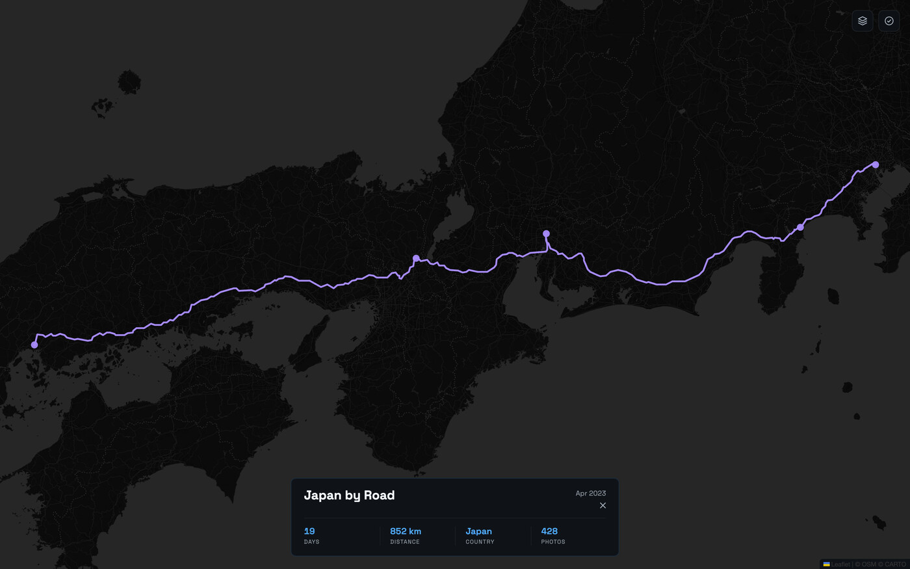

The world view draws every trip at once, each in its own colour, dimmed just
enough to read as a whole. Click a trip — in the list or straight on one of its
stops — and the map flies to its bounds while the other routes fade almost out
of sight.

The fit is aware of the furniture: the journeys panel and the detail card float
*over* the map, so the bounds are fitted to the space they leave visible rather
than to the container. Nothing important ends up behind a panel.

Dismiss with `Esc`, the ✕, a click on the map, or by clicking the same trip
again — and the map glides back to the world.

<br clear="right" />

### 📋 The Journeys Panel

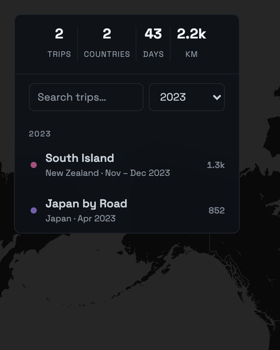

Trips are grouped by year, newest first, each row carrying its colour, the
countries it crossed, its dates and its distance.

Above them, four aggregate numbers — **trips, countries, days, kilometres** —
that always describe *what you're looking at*: type a country, or pick a year,
and the totals recompute for the filtered set.

Hovering a row highlights that route on the map before you commit to it. On a
phone the panel becomes a bottom sheet; hide it and you get the map edge to
edge, and it stays hidden until you say otherwise.

<br clear="left" />

### 📍 Stops, Named

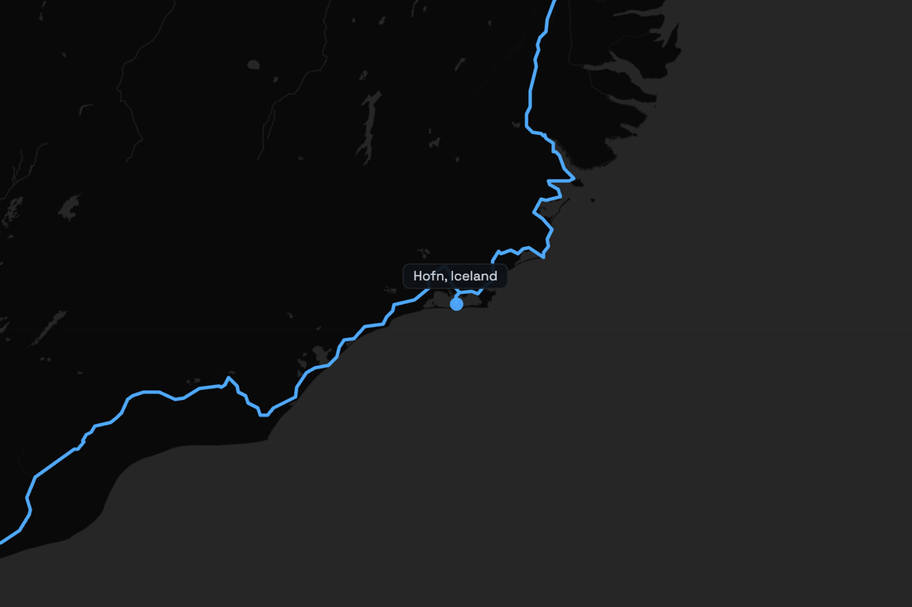

Every place you stopped is a dot on its trip's route, scaled by zoom so dense
clusters don't fuse into a blob. Hover one and it tells you where it is.

Legs that can't be driven — flights, ferries, ocean crossings — are simply left
as gaps in the track. They still count towards the trip's distance (see
[`npm run km`](#development)), and the report tells you how much of a total came
from hops rather than roads.

A ring at your home city anchors the whole map.

<br clear="right" />

### 🎨 Four Basemaps, Two UI Themes

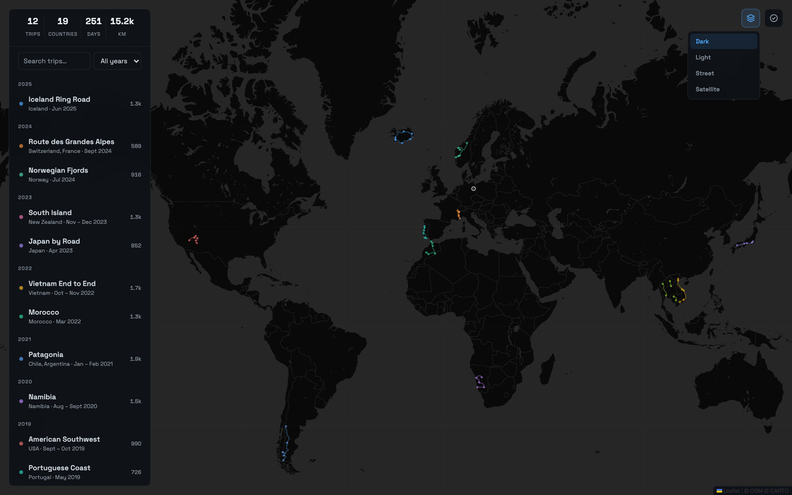

**Dark**, **Light** (both CARTO), **Street** and **Satellite** (both Esri) —
switchable from the corner, no tokens or accounts for any of them.

The basemap drives the whole interface: picking a light style repaints the
panels, the type and the markers in a light palette. On busy or pale tiles the
routes gain a casing — a halo drawn underneath in a dedicated map pane — so
trip colours tuned for dark tiles keep their contrast over satellite imagery
and street maps alike.

<br clear="left" />

<div align="center">
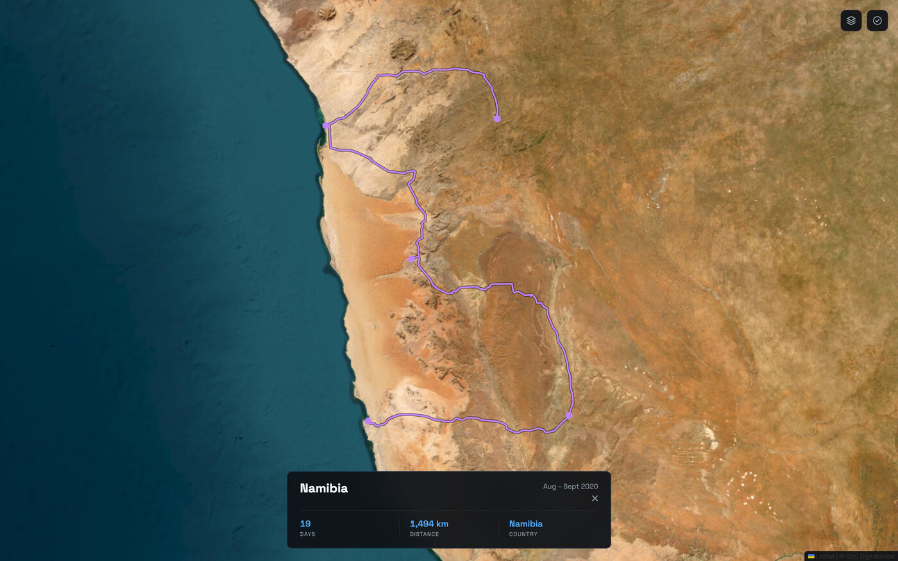&nbsp;
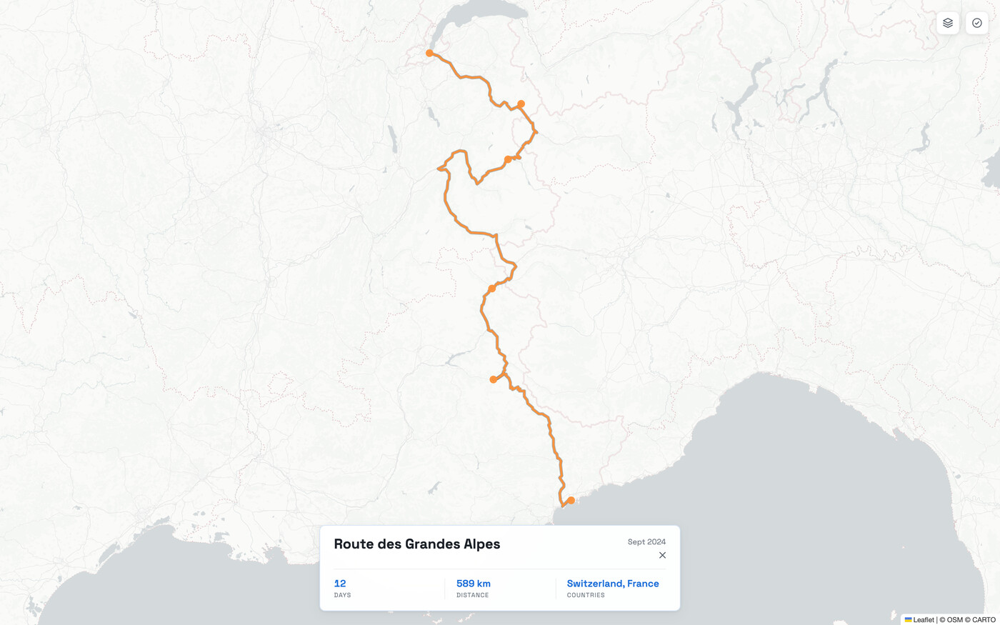
</div>

### 🌍 The Visited-Countries Layer

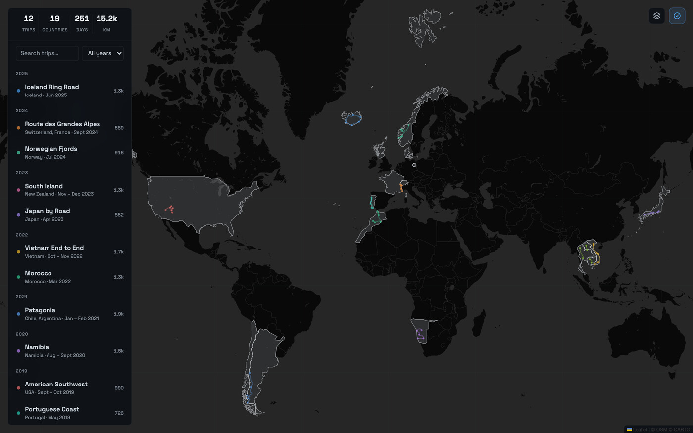

One toggle turns the map into a scratch map: every country any trip has touched
gets a neutral tint, independent of the route colours.

- Countries come from each trip's own `countries` list, plus an
  `extraVisitedCountries` array for places you've been with no recorded route.
- **England, Scotland, Wales and Northern Ireland** are distinguished
  separately, which the world atlas doesn't do on its own.
- **Overseas territories are excluded by distance**, so a trip to mainland
  France doesn't quietly claim French Guiana.
- Boundary data (~380 kB gzipped) is a code-split chunk fetched the first time
  you switch the layer on — it costs nothing if you never do.

<br clear="right" />

---

## How It's Built

**There is no backend.** The app is a static bundle; the data is two things in
the repo — an array of trip objects and one GeoJSON file per trip. Adding a trip
is a commit, and the aggregate stats fall out of the data.

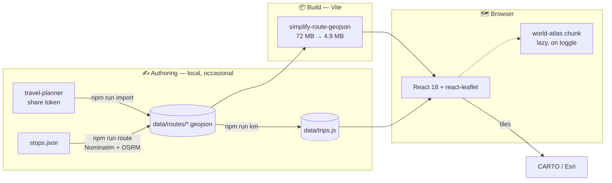

| Layer | Choice |
|---|---|
| Frontend | React 18 + Vite 5, plain CSS with custom properties for theming |
| Map | Leaflet 1.9 via react-leaflet 4 — routes as GeoJSON layers, stops as `divIcon` markers |
| Tiles | CARTO Dark/Light + Esri Street/Satellite — all keyless |
| Country shapes | `world-atlas` 50 m + `topojson-client`, plus a bundled UK-nations topology |
| Trip data | `data/trips.js` (metadata) + `data/routes/*.geojson` (geometry) — or the synthetic set under `demo/` |
| Routing / geocoding | Public OSRM + Nominatim, at authoring time only — never at runtime |
| Hosting | Any static host; Cloudflare Pages config included |

Design decisions worth knowing about:

- **Paint order is pinned to explicit Leaflet panes** (visited countries → route
  casing → routes → markers) rather than to layer-creation order, which
  otherwise shifts as layers are re-created.
- **Layers are restyled, never rebuilt.** Selection changes a route's `style`
  prop; React keys deliberately exclude selection state so a click doesn't
  re-parse a million coordinates.
- **Distance is measured, not typed in.** `npm run km` derives every `kmTotal`
  from the geometry and writes it back into `trips.js`.
- **Dates are handled entirely in UTC**, so a trip starting on 1 January doesn't
  jump into the previous year for readers west of Greenwich.

---

## Self-Hosting Guide

The app is yours to fill with your own trips. There is nothing to provision: no
database, no auth provider, no tile subscription.

### 1. Prerequisites

- **Node.js 20+** and npm (`.nvmrc` pins 22)
- Any static host for the production build — Cloudflare Pages, Netlify, Vercel,
  GitHub Pages, or a plain nginx directory
- **No API keys of any kind.** Tiles come from CARTO's and Esri's public
  endpoints; geocoding and routing use the public Nominatim and OSRM services,
  and only when you run the authoring scripts

### 2. Clone and Install

This is a template repository: to keep your own map, hit **Use this template**
on GitHub first — and choose **Private** unless you want your travel history
public, since your trips will be committed to your copy — then clone that. A
plain clone is fine for a quick look:

```bash
git clone https://github.com/thkleinert/travel-map.git travels
cd travels
npm install
npm run demo         # → http://localhost:5174, backed by the demo dataset
```

`npm run demo` runs the app against **`demo/trips.js` and `demo/routes/`** — a
synthetic log of twelve well-known routes (the one every screenshot in this
README shows). It's there so you can see the thing working, and develop against
it, before committing a single real itinerary. `npm run dev` uses your own
dataset in `data/` instead — and falls back to the demo until `data/trips.js`
exists, so a fresh clone works out of the box.

### 3. Add Your First Trip

A trip is one GeoJSON file in `data/routes/` plus one object in `data/trips.js`
— copy `demo/trips.js` to `data/trips.js` as a starting point; the app switches
to your dataset as soon as that file exists. (The demo dataset is the same two
things under `demo/` — a handy template, and `demo/stops/*.json` shows what the
stop lists below look like.) Pick whichever
route suits you:

**a. From a list of places** — the usual path. Write the stops in travel order:

```json
["Reykjavik", { "name": "Höfn, Iceland" }, { "name": "Akureyri", "fly": true }]
```

```bash
npm run route -- stops.json iceland-2025    # → data/routes/iceland-2025.geojson
```

Names are geocoded via Nominatim, road legs are routed via OSRM, and the script
prints a ready-to-paste `trips.js` entry. Entries can also be raw `[lat, lng]`
pairs. Two flags matter: `"fly": true` arrives by air (no road leg — the gap
counts as flight distance), and `"via": true` routes *through* a place without
drawing a stop marker.

**b. From the [travel-planner](https://github.com/thkleinert/travel-planner) app** —
if you planned the trip there, it already knows the visited places in order and
the routed track:

```bash
npm run import -- <share-token> iceland-2025
```

No geocoding or routing needed; stops are reverse-geocoded only to suggest the
`countries` list.

**c. Bring your own GeoJSON** — a Strava/Komoot/GPX export converted to GeoJSON
works as-is. Drop it in `data/routes/`. `LineString` and `MultiLineString` features
are drawn as track, `Point` features become stops (a `name` property becomes the
hover label), and anything else is ignored.

Then add the entry:

```js
{
  id:          'iceland-2025',        // unique, matches the filename
  name:        'Iceland',
  countries:   ['Iceland'],           // every country visited, in travel order
  dateStart:   '2025-06-01',          // ISO 8601
  dateEnd:     '2025-06-14',
  kmTotal:     0,                     // filled in by `npm run km`
  photoCount:  0,                     // 0 hides the photos stat
  geojsonPath: '/iceland-2025.geojson',
  destCoords:  [64.96, -19.02],       // fallback if the GeoJSON is missing
  color:       '#FB923C',             // optional — omit to auto-assign
}
```

…and measure it:

```bash
npm run km           # writes kmTotal for every trip
npm run km:check     # dry run — shows the diff only
```

The stats in the panel need no updating; they are computed from the array.

> **Country names matter.** They're matched against Natural Earth's spellings to
> tint the visited-countries layer. A mismatch logs a console warning naming the
> country; add an alias to `NAME_ALIASES` in `src/data/worldCountries.js`
> (`USA` → `United States of America` and friends are already there).

### 4. Make It Yours

| What | Where |
|---|---|
| Home marker | `HOME` in `data/trips.js` — `{ coords: [lat, lng], label }` |
| Countries with no recorded trip | `extraVisitedCountries` in `data/trips.js` |
| Route colours | `PALETTE` in `src/data/tripHelpers.js`; pin a trip with `color:` |
| Basemaps | `MAP_STYLES` in `src/data/mapStyles.js` (url, `theme`, `casing`, `maxZoom`) |
| Colours, spacing, type | the two token blocks at the top of `src/App.css` |
| Default world view | `DEFAULT_BOUNDS` in `src/components/MapView.jsx` |
| Title, description, icons | `index.html` and `public/favicon.svg` |

Colours are assigned by array position, so inserting a trip at the top shifts
every other trip's colour — pin `color:` on the ones you care about.

### 5. Run It

```bash
npm run dev       # Vite dev server on :5174
npm run build     # production bundle into dist/
npm run preview   # serve dist/ locally — worth checking before deploying
npm run lint      # ESLint (React hooks rules included)
```

`npm run dev` serves the full-precision route files straight from `data/routes/`;
`npm run build` thins the copies it emits (see [Performance](#performance)), so
preview the build if you want production behaviour.

### 6. Deploy

The output is static files with **no server-side routing**, so nothing beyond a
file server is required.

**Cloudflare Pages** (what this repo is set up for — `wrangler.toml` included):

- Connect the repo and push to `main`; every push builds and deploys.
- Build command `npm run build`, output directory `dist`, Node 20+.
- Or deploy by hand:
  ```bash
  npm run build
  npx wrangler pages deploy dist --project-name <your-project>
  ```
  (`wrangler.toml` carries the project name — set it to yours.)

**Any other static host:** serve `dist/`. There is a single route (`/`), so no
SPA rewrite rules are needed. Two cache details are worth porting from
[`public/_headers`](public/_headers):

- `/` **and** `/index.html` must be `no-cache`. Pages matches request paths and
  browsers ask for `/`, so an `/index.html`-only rule never fires — and a stale
  HTML file keeps requesting content-hashed chunk filenames that a later deploy
  has already replaced.
- `/assets/*` can be cached forever (`immutable`); those filenames change
  whenever their contents do. `*.geojson` gets a day, plus background
  revalidation.

Anything you want served from the site root — icons, `_headers`, `robots.txt`
— lives in `public/`; the active dataset's `*.geojson` files are copied in
alongside it at build time.

### 7. Keep It Private (Optional)

A travel log is a map of where you personally were, which you may not want
indexed. The app has no auth of its own; put it behind your host's instead —
**Cloudflare Access** in front of a Pages project gives you e-mail-code or SSO
login with no code changes. Failing that, host it on a path nobody guesses and
add a `robots.txt` to `public/`.

---

## Performance

The full-precision tracks of a real, years-deep travel log (the one this app
was built around) add up to **72 MB** and about **967 000 coordinate pairs** —
road-network detail that is invisible on a map opening at zoom 2. So the build
thins the copies it emits:

| | raw | gzipped |
|---|---|---|
| `data/routes/*.geojson` (kept in your repo) | 71.7 MB | 8.8 MB |
| `dist/*.geojson` (served) | **4.9 MB** | **1.5 MB** |

`scripts/simplify-geojson.js` runs Ramer–Douglas–Peucker at a ~11 m tolerance,
rounds to five decimals and drops the unused elevation values. At the zoom
levels a route is ever framed at, the result is pixel-identical. The sources are
untouched, so `npm run km` keeps measuring the real geometry.

The rest of the initial load is ~99 kB gzipped of JavaScript and ~9 kB of CSS.
The 380 kB country-boundary chunk is fetched only when the visited-countries
layer is first switched on.

---

## Accessibility

- Every control has a visible focus ring and a real accessible name; the
  journeys list is a list of buttons, so the whole app is keyboard-operable.
- Panels that slide off-screen are taken out of the tab order and the
  accessibility tree, rather than left focusable but invisible.
- Text colours are held at WCAG AA contrast in both themes — including the small
  print (dates, distances, stat labels) and the tile attribution.
- Touch targets reach ~44 px under `@media (pointer: coarse)`.
- `prefers-reduced-motion` turns off both the CSS transitions and the map's
  fly-to animations.

---

## Development

```bash
npm run dev        # Vite dev server (PORT env var overrides the default 5174)
npm run demo       # …backed by the synthetic demo dataset instead
npm run build      # production build + route simplification
npm run preview    # serve the built output
npm run lint       # eslint . — the react-hooks rules earn their keep here

npm run route -- <stops.json> <trip-id>    # build a route from a stops list
npm run import -- <share-token> <trip-id>  # import from the travel-planner app
npm run km                                 # recompute every kmTotal
npm run km:check                           # …without writing
npm run demo:km                            # same, for the demo dataset
```

Regenerating the demo dataset from scratch, if you ever want to:

```bash
for f in demo/stops/*.json; do
  ROUTES_DIR=demo/routes CONTACT=you@example.com \
    node scripts/make-route.js "$f" "$(basename "$f" .json)" --force
done
npm run demo:km
```

Both authoring scripts refuse to overwrite an existing route file unless you pass
`--force`, and validate the trip id before touching the filesystem. They
rate-limit Nominatim to one request per second per its usage policy — set
`CONTACT=you@example.com` so the User-Agent identifies you.

There is no test suite; `npm run lint` plus a look at `npm run preview` is the
gate.

---

## Project Structure

```
src/
  App.jsx              full-screen shell: map controls, panels, selection state
  App.css              design tokens, layout, mobile sheet, motion/touch queries
  components/
    Sidebar.jsx        journeys panel — stats, search, year filter, trip rows
    MapView.jsx        Leaflet map, routes, stops, panes, view fitting
    DetailBar.jsx      floating trip detail card
  data/
    tripHelpers.js     dates, countries, palette, distances — no data
    mapStyles.js       the four basemaps
    worldCountries.js  visited-countries geometry, name aliases, shape fixes
    ukCountries.topo.json
data/                  your travel log — trips.js + routes/*.geojson (used when present)
demo/                  synthetic dataset, same shape — DEMO=1, and the fallback
public/                site-root assets — icons, _headers (publicDir)
scripts/
  make-route.js        stops list → routed GeoJSON (Nominatim + OSRM)
  import-trip.js       travel-planner share token → GeoJSON
  compute-km.js        measure kmTotal from the tracks
  simplify-geojson.js  build-time route thinning
  build-uk-countries.js
docs/                  logo and README screenshots
```

---

<div align="center">
  <sub>
    Every screenshot shows the synthetic demo dataset — twelve routes nobody
    actually travelled.<br />
    Map data © <a href="https://www.openstreetmap.org/copyright">OpenStreetMap</a> contributors ·
    tiles © <a href="https://carto.com/attributions">CARTO</a> and
    <a href="https://www.esri.com">Esri</a> ·
    boundaries from <a href="https://www.naturalearthdata.com">Natural Earth</a> ·
    routing by <a href="https://project-osrm.org">OSRM</a>.<br />
    Built with <a href="https://react.dev">React</a>,
    <a href="https://vite.dev">Vite</a> and
    <a href="https://leafletjs.com">Leaflet</a> ·
    <a href="LICENSE">MIT licensed</a>.
  </sub>
</div>
